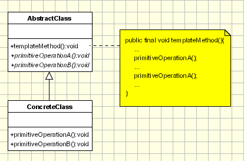

# Template Method
Defines the base of an algorithm in a method, leaving some implementation to its subclasses



## Intent
- Define the skeleton of an algorithm in an operation, deferring some steps to client subclasses. Template Method lets subclasses redefine certain steps of an algorithm without changing the algorithm's structure.
- Base class declares algorithm 'placeholders', and derived classes implement the placeholders.

## Discussion
The component designer decides which steps of an algorithm are invariant (or standard), and which are variant (or customizable). The invariant steps are implemented in an abstract base class, while the variant steps are either given a default implementation, or no implementation at all. The variant steps represent "hooks", or "placeholders", that can, or must, be supplied by the component's client in a concrete derived class.

The component designer mandates the required steps of an algorithm, and the ordering of the steps, but allows the component client to extend or replace some number of these steps.

Template Method is used prominently in frameworks. Each framework implements the invariant pieces of a domain's architecture, and defines "placeholders" for all necessary or interesting client customization options. In so doing, the framework becomes the "center of the universe", and the client customizations are simply "the third rock from the sun". This inverted control structure has been affectionately labelled "the Hollywood principle" - "don't call us, we'll call you".

## Structure
The implementation of template_method() is: call step_one(), call step_two(), and call step_three().  step_two() is a "hook" method – a placeholder. It is declared in the base class, and then defined in derived classes. Frameworks (large scale reuse infrastructures) use Template Method a lot. All reusable code is defined in the framework's base classes, and then clients of the framework are free to define customizations by creating derived classes as needed.

## Rules of thumb
- Strategy is like Template Method except in its granularity.
- Template Method uses inheritance to vary part of an algorithm. Strategy uses delegation to vary the entire algorithm.
- Strategy modifies the logic of individual objects. Template Method modifies the logic of an entire class.
- Factory Method is a specialization of Template Method.

## Implementation
1. Examine the algorithm, and decide which steps are standard and which steps are peculiar to each of the current classes.
1. Define a new abstract base class to host the "don't call us, we'll call you" framework.
1. Move the shell of the algorithm (now called the "template method") and the definition of all standard steps to the new base class.
1. Define a placeholder or "hook" method in the base class for each step that requires many different implementations. This method can host a default implementation – or – it can be defined as abstract (Java) or pure virtual (C++).
1. Invoke the hook method(s) from the template method.
1. Each of the existing classes declares an "is-a" relationship to the new abstract base class.
1. Remove from the existing classes all the implementation details that have been moved to the base class.
1. The only details that will remain in the existing classes will be the implementation details peculiar to each derived class.

## Example
The Template Method defines a skeleton of an algorithm in an operation, and defers some steps to subclasses. Home builders use the Template Method when developing a new subdivision. A typical subdivision consists of a limited number of floor plans with different variations available for each. Within a floor plan, the foundation, framing, plumbing, and wiring will be identical for each house. Variation is introduced in the later stages of construction to produce a wider variety of models.

```
public abstract class HotDrink 
{
    public void PrepareRecipe()
    {
        BoilWater(); Brew(); PourInCup(); AddSpices();
    }

    protected abstract void Brew();

    protected abstract void AddSpices();

    private void BoilWater() { ... }

    private void PourInCup() { ... }
}

public class Coffee : HotDrink 
{
    protected override void Brew() { ... }

    protected override void AddSpices() { ... }
}

public class Tea : HotDrink 
{
    protected override void Brew() { ... }

    protected override void AddSpices() { ... }
}
```